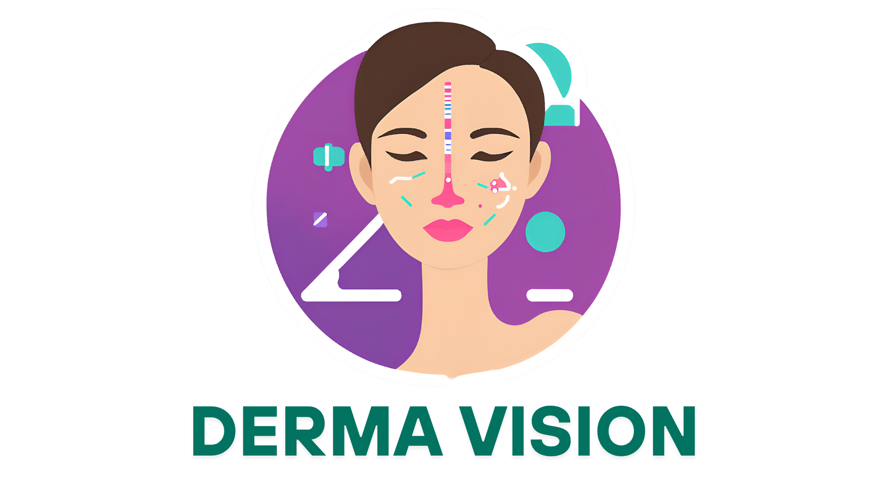

# Derma Vision



## Overview
Derma Vision is an AI-powered web application designed to assist in the early detection of skin conditions, including skin cancer, using deep learning models. Users can upload images of skin lesions, and the system provides a preliminary analysis to help guide further medical consultation.

---

## Features
- **AI-Powered Detection:** Upload images and receive instant analysis using a trained Keras model.
- **User Authentication:** Secure registration and login system.
- **User History:** Track and review previous analyses.
- **Comprehensive FAQ & About Pages:** Learn more about skin health and the project.
- **Responsive Design:** Modern UI with custom CSS for a seamless experience on all devices.

---

## Visuals

### Home Page


### Detection Page


### Report Example


---

## How It Works
1. **Register/Login:** Create an account or log in.
2. **Upload Image:** Go to the detection page and upload a clear image of the skin lesion.
3. **Get Results:** The AI model analyzes the image and provides a preliminary result.
4. **Review History:** Access your previous uploads and results.

---

## Technologies Used
- Python, Flask
- Keras (Deep Learning)
- HTML, CSS, JavaScript

---

## Getting Started
1. Clone the repository.
2. Install dependencies:
   ```bash
   pip install -r requirements.txt
   ```
3. Run the app:
   ```bash
   python app.py
   ```
4. Open your browser and go to `http://localhost:5000`

---

## Disclaimer
*Derma Vision is for educational and preliminary screening purposes only. It is not a substitute for professional medical advice, diagnosis, or treatment. Always consult a qualified healthcare provider for any skin concerns.*

---

## License
MIT License

